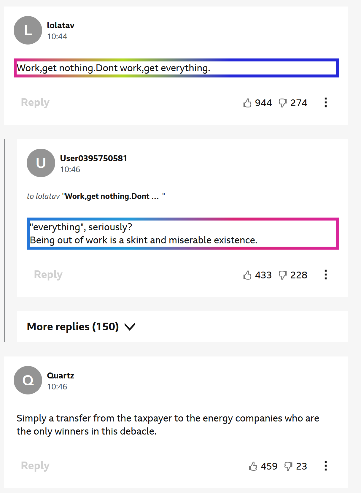

### ⏰ WIP

*as of 19/06/25* will run once, then require browser restart. 
---

### 💡 Purpose

Coming across posts that feature rhetoric on BBC's HYS section, it should be easy to tag these... right?

The comments show poor spelling, weird capitalisation and worst of all, rhetoric (hence the repo name, rheto**ric** metric). 

Border colours fingerprint to keywords. If grayscale, it's only strongly worded.

---

### 🗺️ Layout

Runs in Gecko based-browsers. Requires npm since you're building from source. 

Analyse each comment:

1. Check for keyword spamming within every sucessive clause. If subclause embedding distance is high, that's spamming.

2. Check for ranting. If clause-to-clause sentiment confidence is high, there's only one meaning from this text. 

# *Future*

- See if LLM's keyword-in-context is placed in same locations between different authors/possible sockpuppets, so 'detect LLM accent'

- See if same author/account has unsually wide embedding space layout, would indicate highly knowledgable user using keywords from all topics or possible account sharing.
---

### Installation

1. git clone https://github.com/198thread/ricmetric

2. Manually download the models and config files from:

    https://huggingface.co/Xenova/bge-base-en-v1.5
    
    https://huggingface.co/Xenova/distilbert-base-uncased-finetuned-sst-2-english
    
    Using git won't work.

It should be in this structure within the clone:

    - README.md
    - package.json
    - package-lock.json
    - src
    - models
        - Xenova
            - bge-base-en-v1.5
                - onnx
            - distilbert-base-uncased-finetuned-sst-2-english
                - onnx

3. npm install

4. npx webpack

5. Navigate to about:debugging#/runtime/this-firefox and `Load temporary Add-on`. Find your newly created Add-on.

6. Navigate to any bbc.com page where there are comments on a News Item